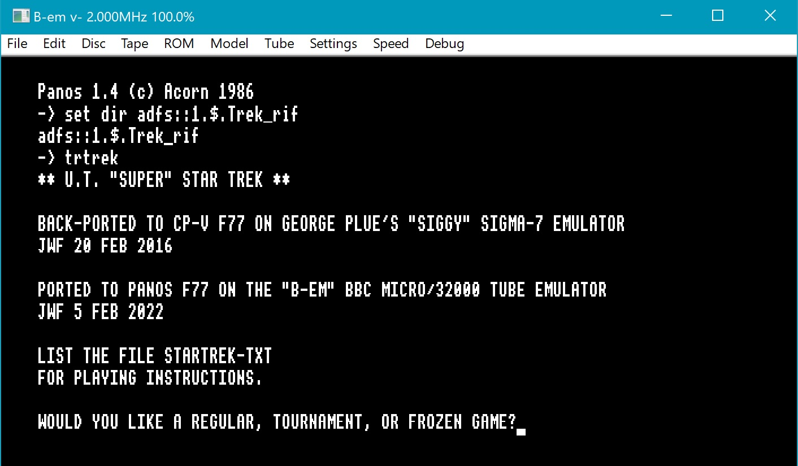
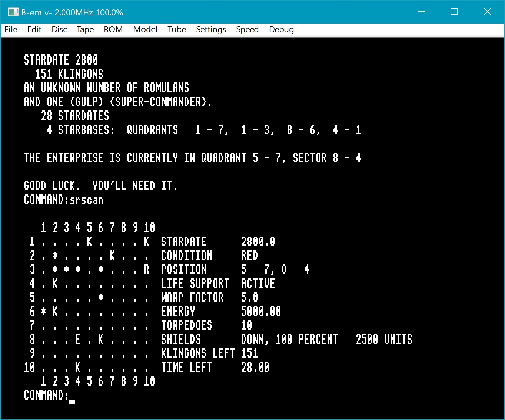
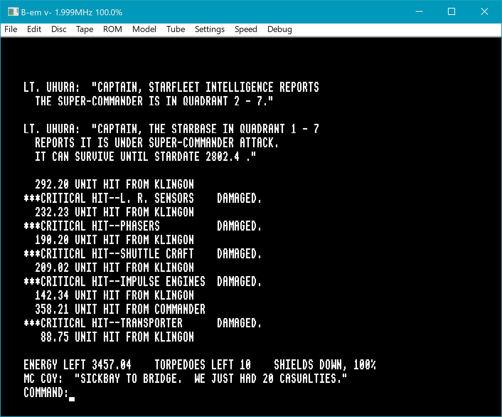
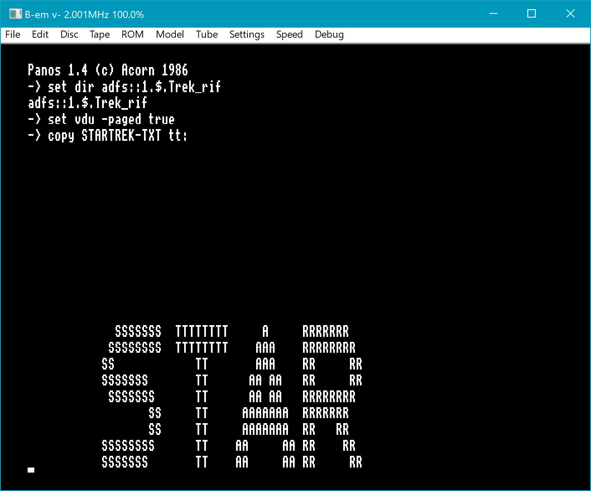
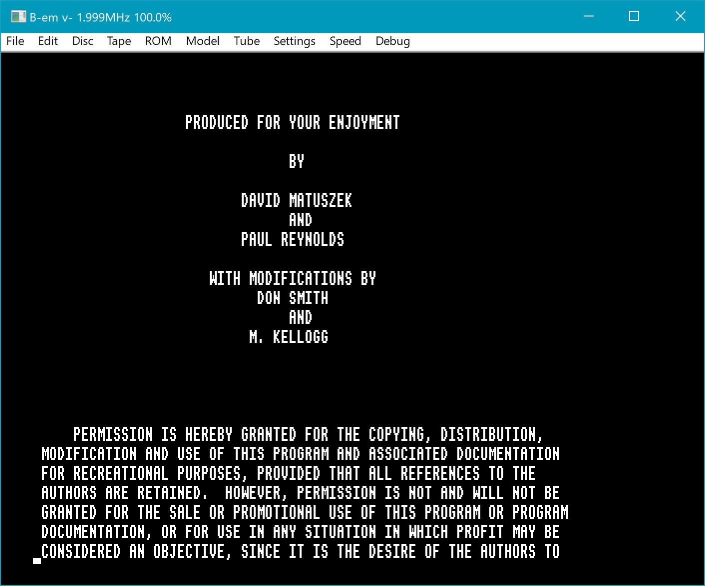
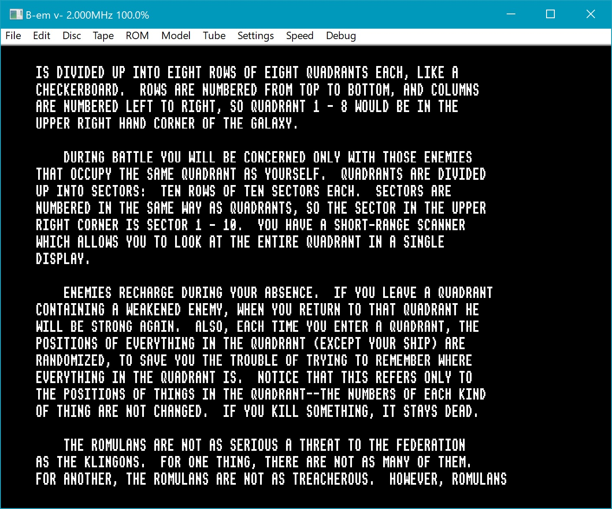
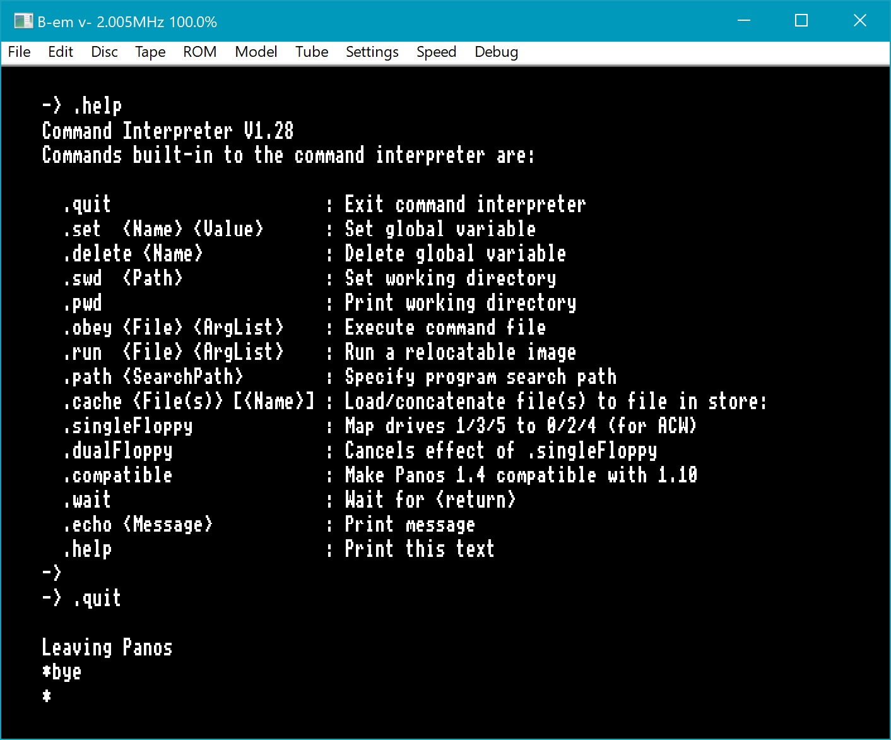

## Installation

If you don't already have b-em set up on your system, download and extract b-em-master.zip from this Github repository, and follow the instructions under "Compiling" on the README of the main page above. If you do already have a b-em installation, you may want to make a copy of your existing configuration directory before proceeding further.

Then, follow the instructions in the README in the "config" subdirectory of this directory.

## Starting and running the "Super Star Trek" game

Start b-em and boot into Panos (see the screenshots in the README of the "config" subdirectory below). Then change the default directory to the one containing the game executable, and type the name of the executable to start the game.

Answer the initial questions, and then play the game! Detailed instructions are in the file STARTREK-TXT (accessible in Panos in the same directory as the game executable, and also in the "source" subdirectory below).

## Some tips

1. About "TOURNAMENT" games: The idea behind a "tournament" game is that the name or number you type in, to identify the tournament, is then used to seed a random number generator, resulting in an identical sequence of pseudo-random numbers, in turn resulting in identical games for identical actions. So it provides a level playing field for people to compete against each other -- the chance element is held constant. The calls to RANF(0) in the original VAX code are mapped to calls to IFXRANDOM() in Panos. For a "REGULAR" game, the seed is set (IFXSETRANDOMSEED) from the system time (IFXBINARYTIME). For a "TOURNAMENT" game, the seed is provided by the user. NOTE: If you use an alphanumeric string as your tournament name (i.e., anything starting with a letter), then only the first four characters (32 bits worth) are significant. If you use all numbers, they get converted to floating-point and then truncated to integer to form the seed, so anything in the range 1..9999999 will provide a unique sequence of pseudo-random numbers. A negative number is converted to its absolute value; leading 0's are ignored. The first occurrence of a letter in a string of digits terminates the number at the digit before it.

2. About "FROZEN" games: You can use the command "FREEZE" to save the current state of an in-progress game to a file and exit the current game (but not the program). You'll then get the "ENTER FILE NAME:" prompt; just typing the Return key at this point results in the "GAME NOT FROZEN." message followed by the reappearance of the "COMMAND:" prompt. The "freeze file" created contains data about the current state of the game. It gets "-TRK" automatically appended to a user-selected name, which is significant to 7 characters (not including the -TRK extension), and should be an alphanumeric string which must start with a letter (anything typed beyond the allowed length is ignored; non-alphanumeric characters after the initial letter may be either ignored or result in a file with an unexpected name). After the "FREEZE" command is executed, you'll get the "DO YOU WANT TO PLAY AGAIN?" prompt. The game can be resumed then or at any later time by selecting "FROZEN" as the response to the initial question about the type of game wanted, and responding to the "ENTER FILE NAME:" prompt. The file name typed should omit the "-TRK" appended extension -- that's added automatically. If the file doesn't exist, you'll get the "GAME NOT FROZEN." message followed by a repeat of the question about the type of game wanted.

3. About the "EMEXIT" Emergency Exit command: This performs an automatic "freeze" of the game to a file named EMSAVE-TRK (any previously-existing file of that name is overwritten), and then the program itself (not just the current game) is exited. Before exiting, the screen is "cleared" (by calling subroutine GETOUT in trgetou-f77 which in turn calls SKIP in trskip-f77) by emitting 24 blank lines. The game can later be resumed as with any FROZEN game, by selecting "EMSAVE" as the "freeze file" name. This facility was presumably provided to enable a quick exit in case the boss was about to make an appearance, though in our case the "STOP" on the terminal just before the "->" command prompt is a bit of a giveaway.

4. Getting a list of commands: If you type "?" at the "COMMAND:" prompt, you'll get a list of legal commands (this is true if you type anything that's not recognized as a command, as indicated by the "UNRECOGNIZED COMMAND" message). Do **not** type "HELP"! ("HELP" is a long-range transporter command to get out of a tight spot; it can save or destroy the ship.) Most commands can be abbreviated, but a few (TERMINATE, FREEZE, DESTRUCT, DEATHRAY, HELP) must be typed in full in order to be recognized.

5. Exiting the program: TERMINATE and EMEXIT are the "official" ways to get out, but typing "Esc" will immediately abort the program.

6. The source file trdebug-f77 is an addition to the original VAX complement, and was created in order to add some commands that facilitated testing the game without actually being able to play it very well. In particular, the "DEBUG" command was a generic command that could be attached to any subroutine that needed to be tested. In its final state, it calls the subroutine that generates a commemorative plaque (see the file "plaque.dat" in the "source/original_VAX_code" directory), which is written to a file named "PLAQUE" in the Trek_rif directory (which however is too wide to display properly in the video display). Similarly, if you answer "y" to the question "DO YOU WANT A COPY OF YOUR SCORE ON THE LINE PRINTER?" when terminating a game, a file SCORE will be created in the same directory (overwriting any existing file of that name).

## History

In early 2016, source code for a 70s-era Star Trek text-based game turned up on the Web site of one Oleg Uryutin, who had been a student in the early 80s at the Minsk Radiotechnical Institute and had fond memories of discovering a PDP-11 version of Star Trek and who, with the help of a colleague there, had ported the game from RT-11 to RSX-11M on the PDP-11. His site (which is now, alas, defunct and not even archived on the Wayback Machine) had the source for a VAX Fortran version of the University of Texas "Super Star Trek", which turned out to be possible to port to F77 on Panos, which was done in early 2022.

The unmodified VAX source code, along with VMS command files to build the executable, are included here in the directory "source/original_VAX_code", for reference. (The VAX code builds and runs without a hitch on a SimH VAX-11/780 running VMS 4.7 and VAX Fortran V4.8-276. The top-level build command is "@TREKBLD".)

## Detailed game instructions

These are available in the source directory (in file "STARTREK-TXT"), and there is also a copy of the file in Panos in the adfs::1.$.Trek_rif directory. In order to view the latter, it is advisable to turn on "paged" mode for the display ("set vdu -paged true"), though it's likely much more convenient to peruse this file outside of b-em. In paged mode, either the left or right Shift key can be pressed (once) to display the next block of text, or held down to continuously scroll the file. The copy of a long text file to tt: (the display) can be aborted by typing "Esc" (followed by a final press of Shift if in paged mode).

NOTE: Before starting the game, you may wish to turn paged mode **off** if you have it turned on ("set vdu -paged false"). On the other hand, sometimes messages from the game will scroll up off the screen before they can be read, in anticipation of which you might want to keep paged mode on. However, keeping paged mode on means you'll occasionally have to press the Shift key in order to "flush" the display, so it's a bit of a nuisance either way.

## Quitting Panos cleanly

The "official" way to do this is: first, type ".quit" to exit the Panos command interpreter; then at the "*" prompt type "bye". You can then select "File->Exit" from the b-em main menu. (I have not, however, ever experienced any disk corruption from just quitting b-em with Panos running.)

