## b-em configuration files and hard disk images

Copy the two files ("b-em.cfg" and "cmos350.bin") and the "scsi" subdirectory and its contents ("scsi0.dat", "scsi0.dsc", etc.) from the config_files subdirectory here into whatever directory on your local machine is serving as the emulator's configuration directory (on Linux, this will be by default "~/.config/b-em"; on Windows 10, it defaults to "/Users/Your Name/AppData/Roaming/b-em.exe" -- yes, in this case, "b-em.exe" is a directory!). NOTE: If you already have b-em installed, you might want to first preserve your existing b-em configuration directory by renaming it or moving it out of the way before overwriting your current configuration with the one provided here.

The b-em.cfg provided here is based on the default b-em version 2.2 distribution configuration file with the following changes:

####
    Changes to beginning of file:

    model=24         (change;   Model->"BBC Master 128 w/MOS 3.53")
    tube=5           (change;   Tube->"32016")
    tubespeed=0      (addition; Tube->Tube speed->"100%")
    key_logical=true (change;   Settings->Keyboard->"Logical keyboard")

    Changes under "[disc]":

    scsienable=true

    Changes under "[video]":

    ledlocation=0

The change under "[video]" affects the status and disk activity display at the bottom of the screen, and is equivalent to menu selection "Settings->Video->LED location->None". Video settings may be altered to your own taste. The change to "Logical keyboard" makes the behavior of the keys on a standard PC keyboard correspond to their labels; otherwise, the key **positions** will behave as they would on a real BBC micro. This can also be altered to your own taste.

There are four 20MB SCSI hard disk images in the "scsi" subdirectory.

The boot disk, scsi0.dat/scsi0.dsc (with root directory "adfs::0.$"), contains a Panos 1.4 installation, with languages Fortran 77, C, Pascal, Lisp, and the Asm32 32000 assembler:

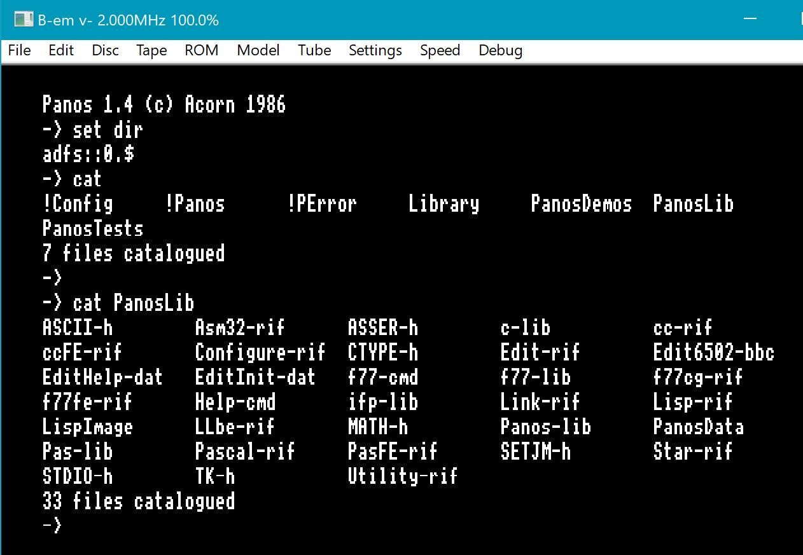

The user disk, scsi1.dat/scsi1.dsc, contains the "Super Star Trek" source code (mostly Fortran 77), compiled object (aof) files, and the game executable (rif) file, together with Panos command files to compile and build the executable.

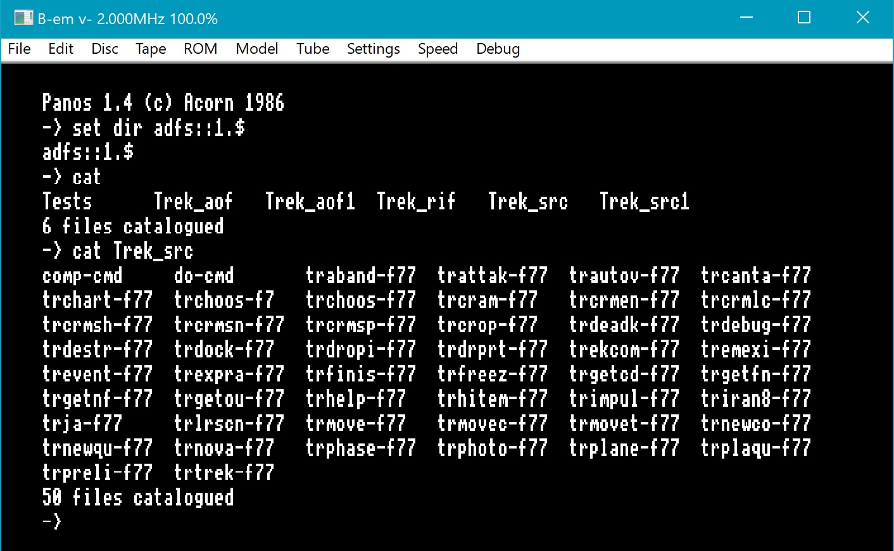

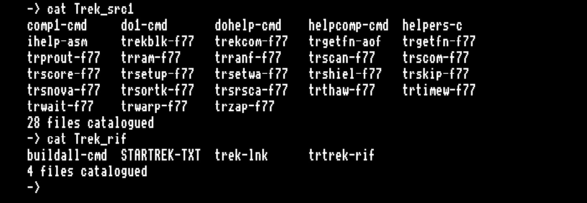

The two remaining disks, scsi2.dat/scsi2.dsc and scsi3.dat/scsi3.dsc are formatted but empty:

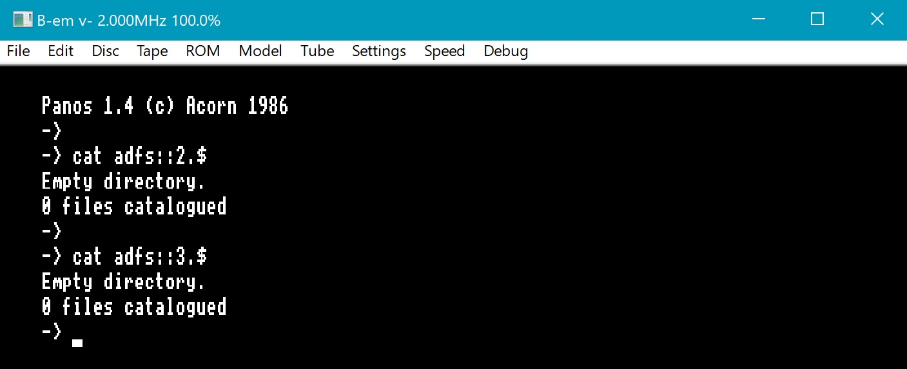

## A quick tour of Panos

Navigating the hierarchical directories in Panos is analogous to moving among directories in a Unix-like system, with the exception that the directory separator is "." rather than a forward (or backward) slash, the symbol for the "upstairs" directory is "^", and each disk drive has its own "root". The equivalent of "ls" (or "dir") is "cat" (for "catalogue", not "concatenate"), and filename extensions are delimited by "-" instead of ".". The wildcard character "*" is accepted. NOTE: To change the working directory, "set" isn't required; i.e., "dir adfs::1.$.Trek_rif" is equivalent to "set dir adfs::1.$.Trek_rif". Either "set dir" or "dir" will display the current working directory.

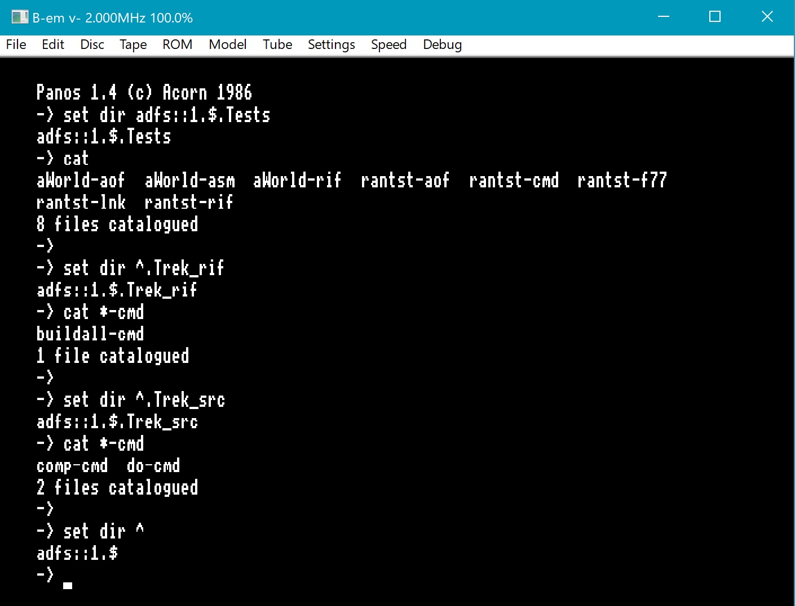

File copy commands take their arguments in the expected Unix order: e.g., "copy comp-cmd tt:" displays the file "comp-cmd" on the screen; but the order can be changed with some explicit directions: "copy -to tt: -from comp-cmd" (but be sure not to leave out the "-" in "-to" or "-from"). NOTE: "copy comp-cmd" (with no destination) is the same as "copy comp-cmd tt:"; i.e., it copies the file to the screen. Much simpler to type! (Files with the "-cmd" extension are command files, the Panos equivalent of Unix shell scripts.)

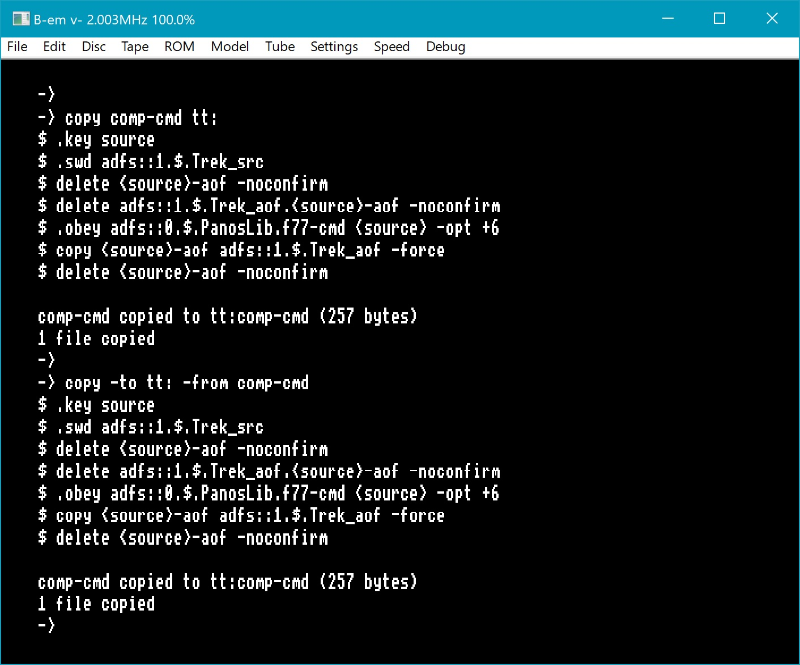

When deleting files, multiple file names need to be a comma-separated list:

####
    -> delete this-txt that-txt
    Error in delete : Cannot attach 'that-txt' to a keyword, detected by 'Parameter'
    ->
    ->
    -> delete this-txt,that-txt
    Delete 'that-txt'? (Y/N) : y
    that-txt deleted
    Delete 'this-txt'? (Y/N) : y
    this-txt deleted
    ->

You can also delete multiple files using the wildcard character "*":

####
    -> delete fWorld-*
    Delete 'fWorld-rif'? (Y/N) : y
    fWorld-rif deleted
    Delete 'fWorld-f77'? (Y/N) : y
    fWorld-f77 deleted
    Delete 'fWorld-aof'? (Y/N) : y
    fWorld-aof deleted
    ->

Creating a new directory is easy, but deleting it requires the "-force" option:

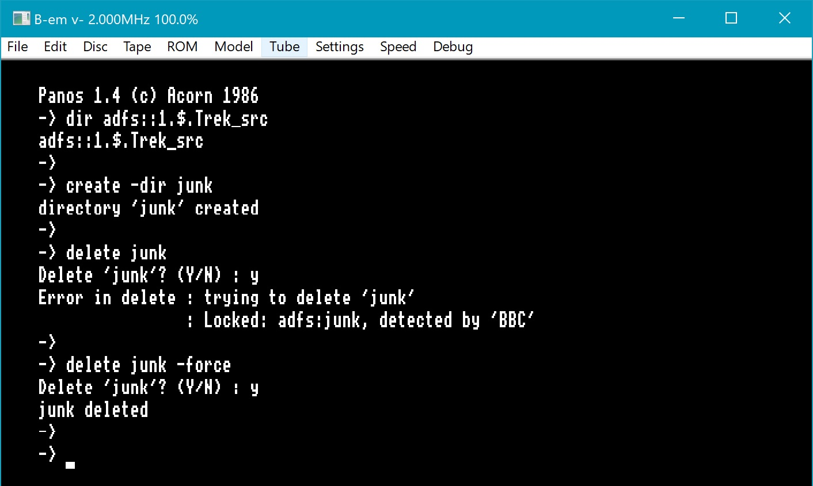

Copying a file over an existing file also requires the "-force" option. The "-noconfirm" option will omit the "Delete 'xyz'? (Y/N) :" question.

If you want to copy multiple files from one directory into another, use the wildcard "*" in both source and destination. NOTE: Independently of disk capacity, there is a limit on the number of files **with the same extension** (not the number of files per se, or the total size of the files) that an ADFS directory can contain, which is why the Super Star Trek source and object files have had to be split among Trek_src/Trek_src1 and Trek_aof/Trek_aof1 directories. The limit seems to be 47 *-f77 or *-aof files in a single directory.

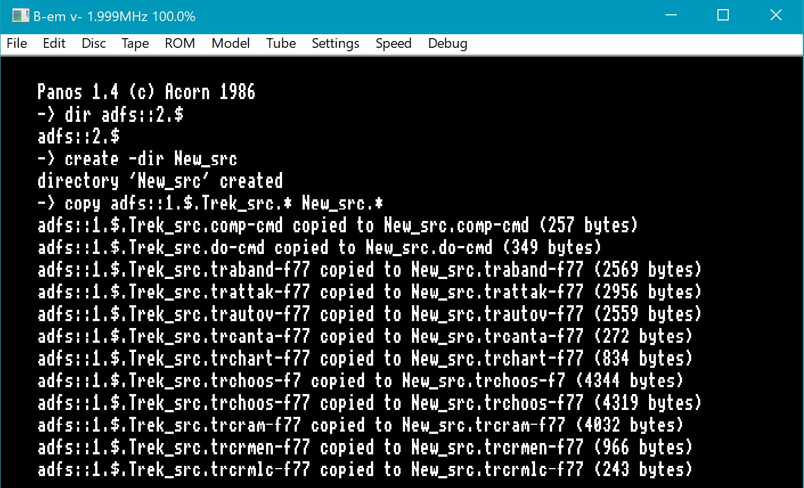

Panos also features an on-line help tree:

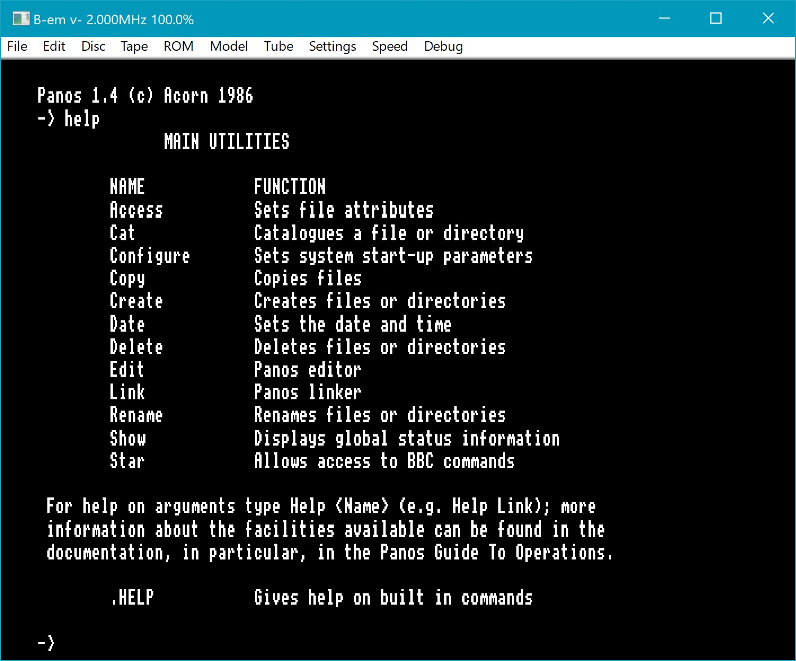

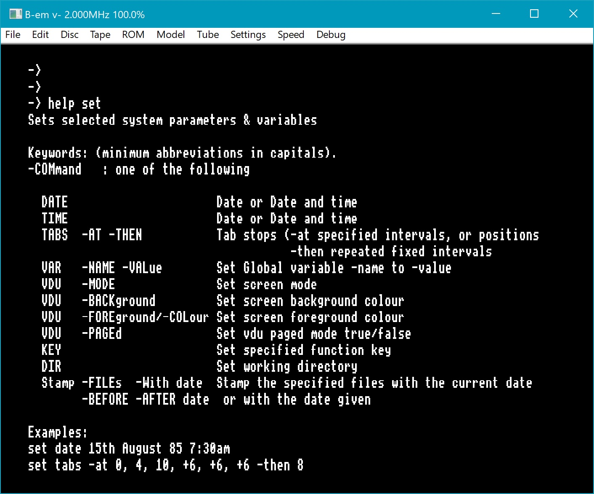

## Customized CMOS settings

NOTE: The CMOS settings file "cmos350.bin" provided here has been altered from the default distribution version of the file by having issued the commands:

####
    *CONFIGURE FILE 14  (or CO. FILE 14)
    *CONFIGURE HARD     (or CO. HARD)
    *CONFIGURE DIR      (or CO. DIR)

Now (after having reset with Ctrl-Break ["Break" is F12], "File->Hard Reset" from the menu, or just exiting and restarting b-em) the system starts up with ADFS (rather than DFS) as the default filing system, uses the hard disk by default rather than the floppy disk, and automatically mounts the hard disk, sets the default directory (to adfs::0.$), and sets the library to "Library". It is now possible to start Panos by just typing "*PANOS":

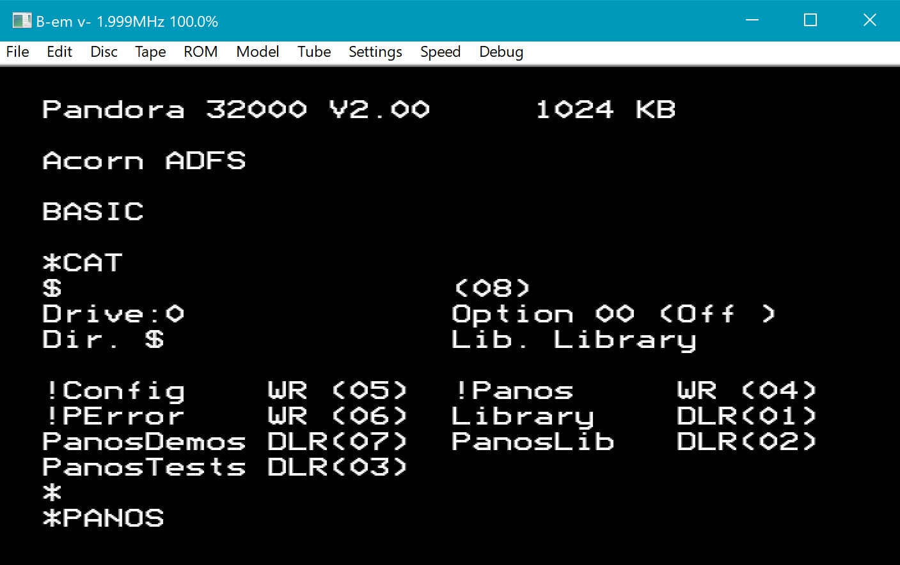

Whereas with the default cmos350.bin, an initial "*ADFS" command would be required:

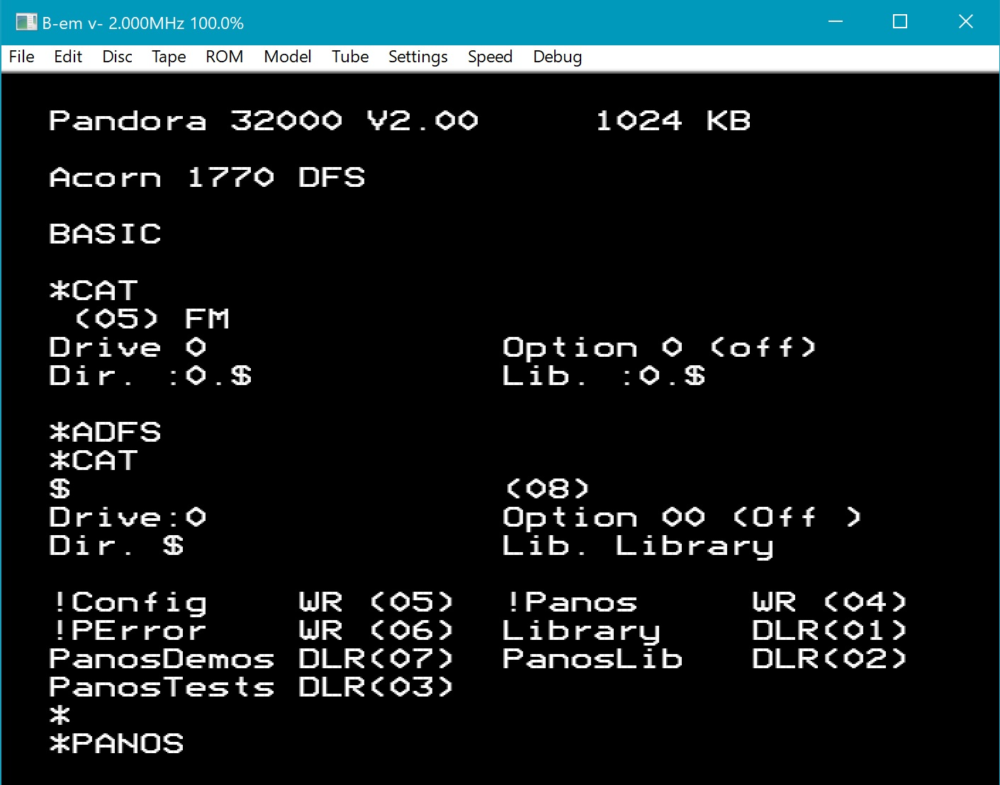

NOTE: You don't have to repeat the above sequence of *CONFIGURE commands; the cmos350.bin file provided here already has those changes. But if you use a fresh cmos350.bin, then you might want to repeat the *CONFIGURE commands, to default to the hard disk with ADFS and Panos.
